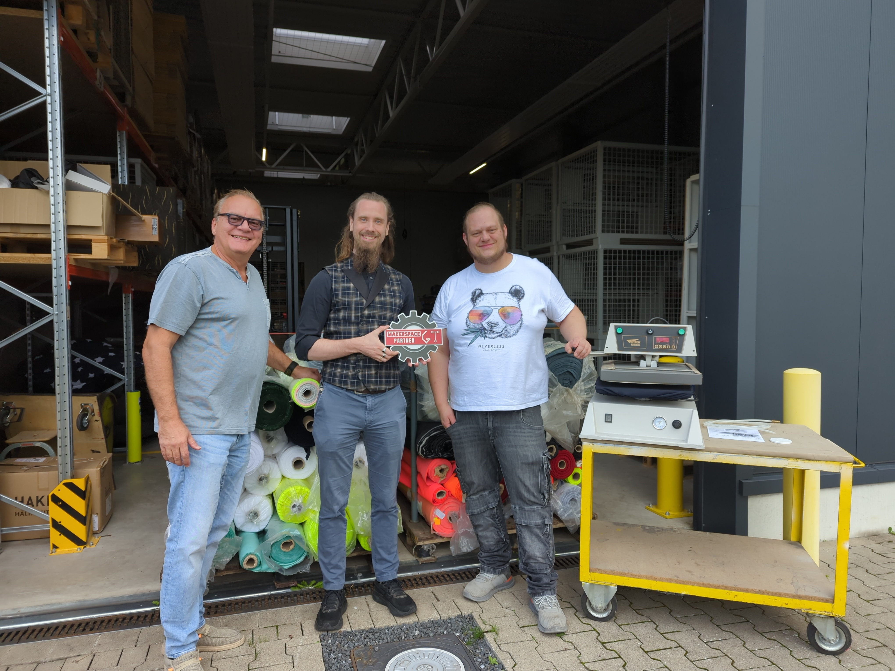
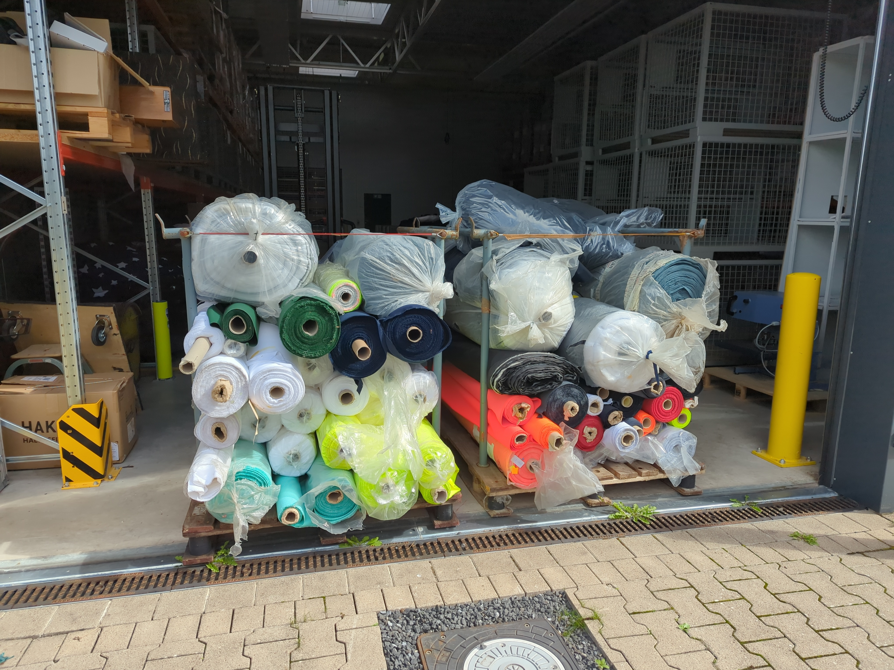

# make it sew - Förderantrag

## Antragsvoraussetzungen:

- Mit der Maßnahme wurde noch nicht begonnen – erfüllt
- Keine Zahlung an sich selbst – erfüllt
- Keine alternative Förderung – erfüllt
- Durchführung in Nordrhein-Westfalen – erfüllt
- Eine Maßnahme pro Jahr – erfüllt

## Rechtsform:

Juristische Person des privaten Rechts

## Zuwendungsempfängerin/Zuwendungsempfänger

Makerspace Gütersloh e.V.  
Bogenstraße 1-8  
33330 Gütersloh

Tel.: +49 5241 2249913  
E-Mail: post@makerspace-gt.de  

## Kontoinformationen

Kontoinhaberin oder -inhaber: Makerspace Gütersloh e.V.  
IBAN: DE52 4786 0125 1226 2315 00  
BIC: GENODEM1GTL  
Kreditinstitut: Volksbank Bielefeld-Gütersloh

## Vertretungsberechtigte Person

Vorstand  
Michael Prange  
Bogenstraße 1-8  
33330 Gütersloh

Tel.: +49 5241 2249913  
E-Mail: post@makerspace-gt.de

## Ansprechperson

Vorstand  
Michael Prange  
Bogenstraße 1-8  
33330 Gütersloh

Tel.: +49 5241 2249913  
E-Mail: post@makerspace-gt.de

## Maßnahmenangaben

### Titel der Maßnahme

make it sew

### Kurzbeschreibung der Maßnahme (2.000 Zeichen)

Der Makerspace Gütersloh e.V. ist eine offene Werkstatt, in der Maschinen und Werkzeuge gemeinschaftlich erforscht und genutzt werden. Unter dem Motto "Mach doch, was du willst!" animieren wir Mitglieder, Gäste und interessierte Personen dazu, sich selbst kreativ auszuleben und neue Dinge zu erschaffen. Wir haben verschiedene Kenntnisse, von laienhaft interessiert bis professionell, und unterstützen uns einander bei Projekten, die wir alleine nicht umsetzen könnten.

Anlässlich des 200-jährigen Stadtjubiläums möchten wir mit dem Projekt "make it sew" die Textilgeschichte Güterslohs erlebbar machen. Historisch ist diese durch die Nähe zur Stadt Bielefeld begründet und spiegelt sich durch das stilisierte Spinnrad im Wappen der Stadt wider. Wir wollen dem Konsumwahn und der Wegwerfgesellschaft Einhalt zu bieten und den Bürger*innen ein Wertgefühl für Textilprodukte vermitteln, indem sie diese selbst herstellen und reparieren.  
Von den ehemals zahlreichen bedeutenden Textilunternehmen der Stadt existieren heute nur noch Güth & Wolf, Niemöller & Abel, Maas Natur und Busch PROtective.

Seit 2020 gibt es in unserer Werkstatt die Möglichkeit zur Textilbearbeitung. Aufgrund der Corona-Pandemie hat es jedoch bis April 2024 gedauert, bis sich eine monatliche Nähbar etabliert hat. Diese ist mittlerweile so gut besucht, dass wir regelmäßig an unsere Grenzen stoßen. Wir konnten die Unternehmen Niemöller & Abel und Güth & Wolf auf uns aufmerksam machen. Sie haben uns angeboten, dass wir deren Produkte (Bänder, Gurte und Stoffe, aus denen Arbeits- und Rettungskleidung hergestellt wird) für unsere Projekte in der Nähbar zu verwenden. Durch diese Partnerschaften setzen wir als Verein unser regionales Traditionshandwerk im Kleinen fort.

Mit zusätzlichen Maschinen und Zubehör könnten wir mehr Menschen an dieses Handwerk heranführen und vielfältigere Techniken anbieten.  
Ein konkretes Einstiegsprojekt ist die Herstellung von wiederverwendbaren Geschenkbeuteln.

### Durchführort der Maßnahme:

33330 Gütersloh  
Gemeindekennziffer: 05754008  
Kreis: Kreis Gütersloh  
Regierungsbezirk: Reg.-Bez. Detmold

## Vorsteuerabzug

Nicht vorsteuerabzugsberechtigt

## Gesamtkosten:

| Beschreibung der Ausgabe |    Betrag in € | Link                                                                                                         |
| :----------------------- | -------------: | :----------------------------------------------------------------------------------------------------------- |
| Nähmaschine              |       599,00 € | https://www.naehwelt-flach.de/brother-innov-is-a65-computer-naehmaschine-testsieger.html                     |
| Overlock                 |       945,00 € | https://www.naehwelt-flach.de/baby-lock-enspire-4-faden-overlock-oxid.html                                   |
| ~~Overlock + Cover~~     |     1.300,00 € | https://www.naehwelt-flach.de/juki-mo-735-4-3-faden-overlock-cover-2-5-5mm.html                              |
| Schmalkantfuß            |        22,31 € | https://internaeht.de/Bernette-Schmalkantfuss-fuer-B37-B38                                                   |
| ~~Nähfußset~~            |       105,00 € | https://www.naehwelt-flach.de/bernette-naehmaschinen-naehfuss-set-10-teilig-b37-b38.html                     |
| Nähgarn                  |        64,90 € | https://www.naehwelt-flach.de/naehwelt-flach-toldi-guetermann-acryl-garnbox-mit-40-farben-500-m.html         |
| Stickrahmen              |       567,00 € | https://makema.de/products/bernette-magnetischer-stickrahmen?variant=55249530225015                          |
|                          |                | https://makema.de/products/bernette-magnetischer-stickrahmen?variant=55249530257783                          |
|                          |                | https://makema.de/products/bernette-magnetischer-stickrahmen?variant=55249530290551                          |
| Stickfolie               |        27,80 € | https://makema.de/products/sulky-solvy                                                                       |
|                          |                | https://makema.de/products/sulky-ultra-solvy                                                                 |
| Schneidplottermatte      |        52,10 € | https://www.naehwelt-flach.de/brother-cm-dc-scanncut-standardmatte-30-5-cm-x-61-cm.html                      |
|                          |                | https://www.naehwelt-flach.de/plottix-freshmat-spruehkleber-250-ml-geeignet-fuer-plotter-schneidematten.html |
| **SUMME**                | **2.278,11 €** |

Zuwendungsfähige Ausgaben: 2.2278,11 €  
Automatisch beantragte Zuwendung: 2.000,00 €  
Hochgeladene Dokumente:  

Ausgaben:
- [1 - Nähmaschine - Nähwelt Flach.png](./Angebote/1%20-%20Nähmaschine%20-%20Nähwelt%20Flach.png) 3.9 MiB
- [2 - Overlock - Nähwelt Flach.png](./Angebote/2%20-%20Overlock%20-%20Nähwelt%20Flach.png) 2.3 MiB
- [3 - Schmalkantfuß - internaeht.d](./Angebote/3%20-%20Schmalkantfuß%20-%20internaeht.d)e.png 990 KiB
- [4 - Nähgarn - Nähwelt Flach.png](./Angebote/4%20-%20Nähgarn%20-%20Nähwelt%20Flach.png) 1.4 MiB
- [5.1 - Stickrahmen - Make ma!.png](./Angebote/5.1%20-%20Stickrahmen%20-%20Make%20ma!.png) 1.5 MiB
- [5.2 - Stickrahmen - Make ma!.png](./Angebote/5.2%20-%20Stickrahmen%20-%20Make%20ma!.png) 1.6 MiB
- [5.3 - Stickrahmen - Make ma!.png](./Angebote/5.3%20-%20Stickrahmen%20-%20Make%20ma!.png) 1.5 MiB
- [6.1 - Stickfolie - Make ma!.png](./Angebote/6.1%20-%20Stickfolie%20-%20Make%20ma!.png) 3.2 MiB
- [6.2 - Stickfolie - Make ma!.png](./Angebote/6.2%20-%20Stickfolie%20-%20Make%20ma!.png) 2.3 MiB
- [7.1 - Schneidplottermatte - Nähwelt Flac](./Angebote/7.1%20-%20Schneidplottermatte%20-%20Nähwelt%20Flac)h.png 930 KiB
- [7.2 - Schneidplottermatte - Nähwelt Flach.png](./Angebote/7.2%20-%20Schneidplottermatte%20-%20Nähwelt%20Flach.png) 1.1 MiB

Einnahmen:  
\---

## Dokumentenupload:

Registereinträge:  
- [Vereinsregisterauszug VR 1720.pdf](./Dokumente/Vereinsregisterauszug%20VR%201720.pdf) 152 KiB

Vereinssatzung:  
- [Satzung.pdf](./Dokumente/Satzung.pdf) 294 KiB

## Zustimmungen:

- Einwilligung zur elektronischen Bekanntgabe – Zustimmung erteilt (post@makerspace-gt.de)
- Veröffentlichung meiner Förderdaten – Zustimmung erteilt
- Keine Finanzierung terroristischer Aktivitäten – Zustimmung erteilt
- Hinweis zum Datenschutz – Zustimmung erteilt

# make it sew - Verwendungsnachweis

## Antragsteller:in  

|                                |                          |
| ------------------------------ | ------------------------ |
| Bezeichnung des Antragstellers | Makerspce Gütersloh e.V. |
| Anrede                         | Ohne                     |
| Titel                          |                          |
| Vorname / Name 1               | Makerspce Gütersloh e.V. |
| Nachname / Name 2              |                          |
| Straße und Nr.                 | Bogenstraße 1-8          |
| PLZ                            | 33330                    |
| Ort                            | Gütersloh                |
| Postfach                       |                          |
| PLZ Postfach                   |                          |
| Ort Postfach                   |                          |
| Telefon                        | +49 5241 2249913         |
| Fax                            |                          |
| E-Mail                         | post@makerspace-gt.de    |
| DE-Mail                        |                          |
| IBAN                           | DE52478601251226231500   |

## Vertretungsberechtigte Person

|                        |                       |
| ---------------------- | --------------------- |
| Anrede                 | Ohne                  |
| Titel                  |                       |
| Vorname / Name 1       | Michael               |
| Nachname / Name 2      | Prange                |
| Organ / Vertretungsart | Vorstand              |
| Straße und Nr.         | Bogenstraße 1-8       |
| PLZ                    | 33330                 |
| Ort                    | Gütersloh             |
| Telefon                | +49 5241 2249913      |
| Fax                    |                       |
| E-Mail                 | post@makerspace-gt.de |
| DE-Mail                |                       |

## Ansprechpartner:in

|                |                       |
| -------------- | --------------------- |
| Anrede         | Ohne                  |
| Titel          |                       |
| Vorname        | Michael               |
| Nachname       | Prange                |
| Straße und Nr. | Bogenstraße 1-8       |
| PLZ            | 33330                 |
| Ort            | Gütersloh             |
| Telefon        | +49 5241 2249913      |
| E-Mail         | post@makerspace-gt.de |

## Angaben zur Maßnahme/ zum Vorhaben

|                              |                                              |
| ---------------------------- | -------------------------------------------- |
| Betreff                      | Verwendungsnachweis zur Maßnahme make it sew |
| Position                     | 1.1 Heimat-Scheck                            |
| Bewilligung vom              | 28.10.2025                                   |
| Aktenzeichen                 | 35.12.01.001/2025-GT-021                     |
| über                         | 2.000,00 €                                   |
| Insgesamt bewilligt          | 2.000,00 €                                   |
| Insgesamt ausgezahlt wurden: | 2.000,00 €                                   |

## Sachbericht

1. Die durchgeführte Maßnahme ist unter anderem mit Beginn, Dauer, Abschluss, Erfolg und Auswirkungen der Maßnahme kurz darzustellen. Gegebenenfalls können auch Videos, Fotos oder ähnliche Darstellungen beigefügt oder auf deren Fundstelle hingewiesen werden. 
2. Bestätigung, dass die Maßnahmen entsprechend dem Zuwendungsantrag und dem Zuwendungsbescheid durchgeführt worden sind, und zwar in Bezug auf die zu Grunde liegenden Planungen, die Qualität und die Standards. Wesentliche Abweichungen sind im Detail in vergleichender Darstellung (Antrag sowie tatsächliche Ausführung) zu beschreiben. 
3. Bestätigung, dass zuwendungsfähige Ausgaben mindestens in Höhe des Finanzierungsplanes des Zuwendungsantrags und des Zuwendungsbescheids entstanden sind.

### Sachbericht

## Zahlenmäßiger Nachweis

|  Nr.  | Leistendes Unternehmen              | Art der Leistung                             | Zahldatum  | Betrag in EUR |     Rabatt | Kommentar  | URL                                                                                                                     |
| :---: | ----------------------------------- | -------------------------------------------- | ---------- | ------------: | ---------: | ---------- | ----------------------------------------------------------------------------------------------------------------------- |
|   1   | Keller Nähmaschinen + Service       | Nähmaschine Brother Innov-is A65             | 12.11.2025 |      495,00 € |   104,00 € | gebraucht  | https://internaeht.de/gebraucht/brother-innovis-a65                                                                     |
|   2   | Brother Sewing Machines Europe GmbH | Overlock Brother Airflow 3000                | 11.11.2025 |        0,00 € |   999,00 € | Sachspende | https://sewingcraft.brother.eu/de-de/produkte/maschinen/overlock-maschinen/overlock-coverstichmaschinen/airflow-3000    |
|   3   | Brother Sewing Machines Europe GmbH | Coverstich Brother CV3550                    | 11.11.2025 |        0,00 € |   899,00 € | Sachspende | https://sewingcraft.brother.eu/de-de/produkte/maschinen/overlock-maschinen/overlock-coverstichmaschinen/cv3550          |
|   4   | Brother Sewing Machines Europe GmbH | Näh- und Quiltmaschine Brother Innov-is F560 | 11.11.2025 |        0,00 € | 1.499,00 € | Sachspende | https://sewingcraft.brother.eu/de-de/produkte/maschinen/naehmaschinen/naehmaschinen-fuer-fortgeschrittene/innov-is-f560 |
|   5   | Keller Nähmaschinen + Service       | Schmalkantfuß Bernette B37/B38               | 12.11.2025 |       22,31 € |            |            | https://internaeht.de/Bernette-Schmalkantfuss-fuer-B37-B38                                                              |
|   6   | Keller Nähmaschinen + Service       | Anti-Haft-Fuß Brother F007N                  | 14.11.2025 |       16,15 € |            |            | https://internaeht.de/Brother-Anti-Haft-Fuss-Horizontal-Greifer-F007N                                                   |
|  12   | Make ma GmbH                        | Sticksoftware creativate Elite               | 13.11.2025 |      719,20 € |   179,80 € | 20% Rabatt | https://makema.de/products/sticksoftware-creativate-elite                                                               |
|  13   | Make ma GmbH                        | Magnetischer Stickrahmen bernette 10x10cm    | 11.11.2025 |      135,15 € |    23,85 € | 15% Rabatt | https://makema.de/products/bernette-magnetischer-stickrahmen?variant=55249530225015                                     |
|  14   | Make ma GmbH                        | Magnetischer Stickrahmen bernette 13x18cm    | 11.11.2025 |      152,15 € |    26,85 € | 15% Rabatt | https://makema.de/products/bernette-magnetischer-stickrahmen?variant=55249530257783                                     |
|  15   | Make ma GmbH                        | Magnetischer Stickrahmen bernette 14x26cm    | 11.11.2025 |      194,65 € |    34,35 € | 15% Rabatt | https://makema.de/products/bernette-magnetischer-stickrahmen?variant=55249530290551                                     |
|  16   | Make ma GmbH                        | Stickfolie SULKY Solvy                       | 11.11.2025 |       17,52 € |     4,38 € | 20% Rabatt | https://makema.de/products/sulky-solvy?variant=55248984899959                                                           |
|  17   | Make ma GmbH                        | Stickfolie SULKY Ultra Solvy                 | 11.11.2025 |       17,52 € |     4,38 € | 20% Rabatt | https://makema.de/products/sulky-ultra-solvy?variant=55248968253815                                                     |

|                                                                |            |
| -------------------------------------------------------------- | ---------: |
| Summe Gesamtkosten                                             |            |
| abzgl. Einnahmen und Leistungen Dritter                        |            |
| Zuwendungsfähige Gesamtausgaben                                |            |
| Förderbetrag                                                   | 2.000,00 € |
| verbleibender Eigenanteil (oder gegebenenfalls Rückzahlbetrag) |            |

Ist die Ausgabensumme niedriger als der Förderbetrag, so sind die Gründe der Ausgabenveränderung darzustellen. Der Differenzbetrag ist zudem umgehend zurückzuzahlen..

## Bestätigungen

Es wird bestätigt, dass...

- [x] die Allgemeinen und Besonderen Nebenbestimmungen des Zuwendungsbescheides beachtet wurden,
- [x] die Ausgaben notwendig waren, wirtschaftlich und sparsam verfahren worden ist und die Angaben im Verwendungsnachweis mit den Büchern und Belegen übereinstimmen,
- [x] für die Durchführung der Maßnahme keine weitere Förderung von Dritten gewährt wurde oder noch gewährt wird,
- [x] die Originalbelege für die Dauer von fünf Kalenderjahren nach Vorlage dieses Verwendungsnachweises für Prüfzwecke vorgehalten werden und
- die Antragstellerin oder der Antragsteller zum Vorsteuerabzug:
  - [x] nicht berechtigt beziehungsweise
  - [ ] berechtigt ist und dies bei der Berechnung der Ausgaben berücksichtigt hat.

## Dokumentenupload

|  Nr.  | Bezeichnung                                    | Name                                                                                  |                                                    |
| :---: | ---------------------------------------------- | ------------------------------------------------------------------------------------- | -------------------------------------------------- |
|   1   | make it sew auf einen Blick                    |                                                                                       |                                                    |
|   2   | Partnerschaft Niemöller & Abel X Makerspace GT | [c1a6127715b34564c0fe909c3f242787.jpg](./Bilder/c1a6127715b34564c0fe909c3f242787.jpg) |  |
|   3   | Stoffspende Niemöller & Abel                   | [5340f285f8da1fb870a04df561445f24.jpg](./Bilder/5340f285f8da1fb870a04df561445f24.jpg) |  |
|   4   | Maschinenspende Brother                        |                                                                                       |                                                    |
|   5   | Stickzubehör Make ma!                          |                                                                                       |                                                    |
|   6   | Nähmaschine internaeht.de                      |                                                                                       |                                                    |
|   7   | Füße internaeht.de                             |                                                                                       |                                                    |
|   8   | Nähgarn Nähwelt Flach                          |                                                                                       |                                                    |
|   9   | Nähnadeln Nähwelt Flach                        |                                                                                       |                                                    |
|  10   | Schneidplottermatte Nähwelt Flach              |                                                                                       |                                                    |
